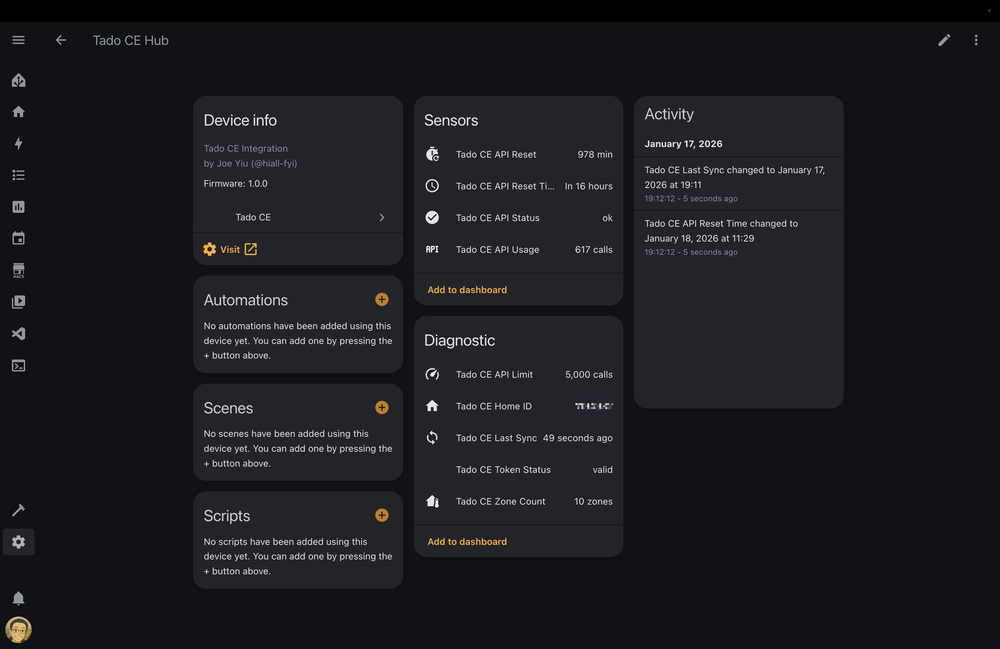

# Tado CE - Custom Integration for Home Assistant

<p align="center">
  
  
  
  
</p>

<p align="center">
  A lightweight custom integration for Tado smart thermostats with <strong>real API rate limit tracking</strong> from Tado's response headers.
</p>

<p align="center">
  <a href="#-features">Features</a> •
  <a href="#-quick-start">Quick Start</a> •
  <a href="#-entities">Entities</a> •
  <a href="#-services">Services</a> •
  <a href="#-troubleshooting">Troubleshooting</a>
</p>

---

### 🎯 Created by Joe Yiu ([@hiall-fyi](https://github.com/hiall-fyi))

<a href="https://buymeacoffee.com/hiallfyi" target="_blank">
  
</a>

*If this integration saves you from rate limit headaches, consider buying me a coffee! ☕*

---

## 🤔 Why Tado CE?

In late 2025, Tado announced they would begin enforcing **daily API rate limits** on their REST API. This caught many Home Assistant users off guard:

| Plan | Daily Limit |
|------|-------------|
| Standard (after grace period) | 100 calls |
| Standard (grace period) | 5,000 calls |
| Auto-Assist subscription | 20,000 calls |

The official Home Assistant Tado integration doesn't show your actual API usage or remaining quota. Users have no way to know if they're about to hit the limit until they get blocked.

**Common issues reported by the community:**

- [Upcoming changes to the tado° API](https://github.com/home-assistant/core/issues/151223) - Official announcement
- [Tado rate limiting API calls](https://community.home-assistant.io/t/tado-rate-limiting-api-calls/928751) - Community discussion
- [Tado Authentication Broken](https://github.com/home-assistant/core/issues/160472) - Auth issues after HA update
- [Tado login fails](https://github.com/home-assistant/core/issues/161054) - Login timeout issues
- [Re-Authentication loop](https://github.com/home-assistant/core/issues/160237) - Keeps asking for re-auth
- [Bad error handling](https://github.com/home-assistant/core/issues/160487) - Poor error messages
- [Tado Integration Stopped Working](https://community.home-assistant.io/t/tado-integration-stopped-working/867145) - Password flow deprecated

**Tado CE was created to solve these problems:**

1. **Real-time rate limit tracking** - See exactly how many API calls you've used
2. **Dynamic limit detection** - Automatically detects your actual limit (100/5000/20000)
3. **Reset time tracking** - Know when your quota resets (rolling 24h window)
4. **Smart day/night polling** - More frequent during day, less at night
5. **Lightweight design** - Minimal API calls, maximum functionality

---

## 🎯 Features

| Feature | Description |
|---------|-------------|
| 🌡️ **Climate Control** | Control all your Tado heating zones (Heat/Off/Auto modes) |
| ❄️ **AC Control** | Full air conditioning support (Cool/Heat/Dry/Fan modes, fan speed, swing) |
| 🚿 **Hot Water Control** | Turn hot water on/off with timer support |
| ⏱️ **Timer Support** | Set heating/cooling/hot water for specific duration or until next schedule |
| 🔥 **Heating Power** | See current heating demand percentage (0-100%) |
| ⏰ **Early Start** | Smart pre-heating to reach target temperature on time |
| 🪟 **Open Window** | Automatic detection when windows are open |
| 🏠 **Home/Away** | Geofencing support with configurable away temperature |
| 🏃 **Away Configuration** | Set temperature/mode when everyone is away |
| 📍 **Presence Detection** | Track mobile devices with geo tracking enabled |
| 🌤️ **Weather Data** | Outside temperature, solar intensity, weather conditions |
| 🌡️ **Temperature Offset** | Calibrate device temperature readings |
| 🔒 **Child Lock** | Enable/disable child lock on radiator valves |
| 💡 **Device Identify** | Flash device LED to locate it |
| ⚡ **Energy IQ** | Add meter readings for energy tracking |
| 📶 **Connection State** | Monitor device online/offline status |
| 🔧 **Firmware Version** | Track device firmware versions |
| 🔐 **Device Auth Flow** | Secure OAuth2 device authorization (password grant deprecated) |
| 🔑 **Rotating Tokens** | Handles Tado's rotating refresh tokens correctly |
| 💾 **Persistent Storage** | Token and data survives Home Assistant reboots |

### 🌟 Tado CE Exclusive

| Feature | Description |
|---------|-------------|
| 📊 **Real API Rate Limit** | Actual usage from Tado API headers, not estimates |
| 🔄 **Rolling 24h Reset** | Automatically detects when your rate limit resets |
| ⚡ **Smart Day/Night Polling** | More frequent during day, less at night to save API calls |

---

## 📋 Prerequisites

- Home Assistant 2024.x or later
- Tado account with V3/V3+ devices
- SSH access to Home Assistant (for initial auth)

---

## 🚀 Quick Start

### 1. Install

**HACS (Recommended)**
```
Add this repository to HACS as a custom repository
Install "Tado CE" from HACS
Restart Home Assistant
```

**Manual Installation**
```bash
# Copy tado_ce folder to custom_components
cp -r tado_ce /config/custom_components/
```

### 2. Authenticate

```bash
# SSH into your Home Assistant
python3 /config/custom_components/tado_ce/tado_api.py auth
```

This will:

- Display a URL to visit
- Show a code to enter on Tado's website
- Wait for you to authorize
- Save the tokens automatically

### 3. Add Integration

1. Go to **Settings → Devices & Services**
2. Click **Add Integration**
3. Search for **Tado CE**
4. Click to add

### 4. Verify Success

Check your Home Assistant logs (**Settings → System → Logs**). A successful setup looks like:

```
Tado CE: Integration loading...
Tado CE: Polling interval set to 30m (day)
Tado CE: Executing full sync
Tado CE full sync SUCCESS
Tado CE binary_sensor: Setting up...
Tado CE water_heater: Setting up...
Tado CE device_tracker: Setting up...
Tado CE switch: Setting up...
Tado CE water heaters loaded: 1
Tado CE switches loaded: 17
Tado CE binary sensors loaded: 10
Tado CE sensors loaded: 69
Tado CE climates loaded: 9
Tado CE: Integration loaded successfully
```

The exact numbers depend on your Tado setup (zones, devices, etc.).

### 5. Device Overview

Once set up, you'll see the Tado CE Hub device with all sensors:

<p align="center">
  
</p>

---

## 📊 Entities

### API Sensors

| Entity | Description |
|--------|-------------|
| `sensor.tado_ce_api_usage` | API calls used today (limit from API header) |
| `sensor.tado_ce_api_reset` | Minutes until rate limit reset |
| `sensor.tado_ce_api_reset_time` | Exact datetime when rate limit resets (timestamp) |

### Weather Sensors

| Entity | Description |
|--------|-------------|
| `sensor.tado_ce_outside_temperature` | Outside temperature at your location |
| `sensor.tado_ce_solar_intensity` | Solar intensity percentage |
| `sensor.tado_ce_weather_state` | Current weather condition |

### Per Heating Zone

| Entity | Description |
|--------|-------------|
| `climate.tado_ce_{zone}` | Climate entity for control |
| `sensor.tado_ce_{zone}_temperature` | Current temperature |
| `sensor.tado_ce_{zone}_humidity` | Current humidity |
| `sensor.tado_ce_{zone}_heating` | Heating power (0-100%) |
| `sensor.tado_ce_{zone}_target` | Target temperature |
| `sensor.tado_ce_{zone}_mode` | Mode (Manual/Schedule/Off) |
| `sensor.tado_ce_{zone}_battery` | Battery status (NORMAL/LOW) |
| `sensor.tado_ce_{zone}_connection` | Device connection (Online/Offline) |
| `binary_sensor.tado_ce_{zone}_open_window` | Open window detected |

### Switches

| Entity | Description |
|--------|-------------|
| `switch.tado_ce_{zone}_child_lock` | Enable/disable child lock |
| `switch.tado_ce_{zone}_early_start` | Enable/disable smart pre-heating |

### Other Entities

| Entity | Description |
|--------|-------------|
| `binary_sensor.tado_ce_home` | Home/Away status (geofencing) |
| `water_heater.tado_ce_{zone}` | Hot water control |
| `device_tracker.tado_ce_{device}` | Mobile device presence |

---

## 🔧 Services

### tado_ce.set_climate_timer

Set heating/cooling with a timer.

```yaml
service: tado_ce.set_climate_timer
target:
  entity_id: climate.tado_ce_lounge
data:
  temperature: 22
  duration: 60  # minutes
```

**Overlay options:**

- `duration: 60` - Timer in minutes
- `overlay: next_time_block` - Until next schedule block
- Neither - Manual (until manually changed)

### tado_ce.set_water_heater_timer

Turn on hot water with a timer.

```yaml
service: tado_ce.set_water_heater_timer
target:
  entity_id: water_heater.tado_ce_utility
data:
  duration: 30  # minutes
```

### tado_ce.resume_schedule

Delete any manual override and return to schedule.

```yaml
service: tado_ce.resume_schedule
target:
  entity_id: climate.tado_ce_lounge
```

### tado_ce.set_temperature_offset

Set temperature offset (calibration) for a device.

```yaml
service: tado_ce.set_temperature_offset
data:
  entity_id: climate.tado_ce_lounge
  offset: 0.5  # Celsius (-10 to +10)
```

### tado_ce.identify_device

Make a device flash its LED.

```yaml
service: tado_ce.identify_device
data:
  device_serial: "VA1234567890"
```

### tado_ce.set_away_configuration

Configure temperature when everyone is away.

```yaml
service: tado_ce.set_away_configuration
data:
  entity_id: climate.tado_ce_lounge
  mode: auto  # auto, manual, or off
  comfort_level: 50  # 0=Eco, 50=Balance, 100=Comfort
```

### tado_ce.add_meter_reading

Add energy meter reading for Energy IQ.

```yaml
service: tado_ce.add_meter_reading
data:
  reading: 12345
  date: "2026-01-17"  # Optional
```

---

## ⏱️ Smart Polling

The integration automatically adjusts polling frequency based on your API limit and time of day.

### Polling Schedule

| API Limit | Day (7am-11pm) | Night (11pm-7am) | Est. Calls/Day |
|-----------|----------------|------------------|----------------|
| 100 | 30 min | 2 hours | ~80 calls |
| 1,000 | 15 min | 1 hour | ~160 calls |
| 5,000 | 10 min | 30 min | ~240 calls |
| 20,000 | 5 min | 15 min | ~480 calls |

### 100 Calls/Day Breakdown

| Time Period | Duration | Interval | Syncs | Calls | Total |
|-------------|----------|----------|-------|-------|-------|
| Day (7am-11pm) | 16h | 30 min | 32 | 2 | 64 |
| Night (11pm-7am) | 8h | 2h | 4 | 2 | 8 |
| Full sync | 24h | 6h | 4 | 2 | 8 |
| **Total** | | | | | **80** |

This leaves a 20% buffer for manual syncs or service calls.

---

## 📱 Supported Devices

| Device | Type | Support |
|--------|------|---------|
| Smart Thermostat V3/V3+ | HEATING | ✅ Full |
| Smart Radiator Thermostat (SRT/VA02) | HEATING | ✅ Full |
| Smart AC Control V3/V3+ | AIR_CONDITIONING | ✅ Full |
| Wireless Temperature Sensor | HEATING | ✅ Full |
| Internet Bridge V3 | Infrastructure | N/A |
| **Tado X Series** | Matter/Thread | ❌ Not Supported |

### ⚠️ Tado X Devices

Tado X devices use Matter over Thread and are **not supported** by this integration. Use the Home Assistant Matter integration instead.

See [Using tado° Smart Thermostat X through Matter](https://community.home-assistant.io/t/using-tado-smart-thermostat-x-through-matter/736576) for setup instructions.

---

## ⚠️ Limitations

| Limitation | Description |
|------------|-------------|
| **Cloud-Only** | All control goes through Tado's cloud servers |
| **No GPS** | Device trackers only show home/not_home status |
| **Rotating Tokens** | If token expires, re-authentication required |
| **No Schedule Management** | Use Tado app for schedule changes |
| **No Historical Data** | Would consume too many API calls |

---

## 🔮 Potential Future Features

These features are technically possible but not yet implemented. PRs welcome!

### ✅ Can Be Added (API Available)

| Feature | Description | API Calls | Priority |
|---------|-------------|-----------|----------|
| **Boost Mode** | Quick temperature boost for X minutes | 1 per action | Medium |
| **Open Window Duration** | Configure open window detection timeout | 1 per zone | Low |
| **Multiple Homes** | Support for users with multiple Tado homes | +2 per home | Low |
| **Air Comfort** | Humidity comfort level indicators | +1 per sync | Medium |
| **Skills/Routines** | Tado's built-in automation rules | Read-only | Low |

### ❌ Cannot Be Added (API Limitations)

| Feature | Reason |
|---------|--------|
| **Local Control** | Tado has no local API - cloud only |
| **GPS Coordinates** | Privacy - API only returns home/away status |
| **Schedule Editing** | Complex API, high call cost, use Tado app |
| **Push Notifications** | No webhook/push API available |
| **Tado X Devices** | Uses Matter protocol, not REST API |
| **Historical Charts** | Would require 100+ API calls per day |
| **Real-time Updates** | No WebSocket API, polling only |

### 🤔 Considering (Need User Feedback)

| Feature | Trade-off |
|---------|-----------|
| **Air Comfort Sensors** | +1 API call per sync, shows humidity comfort |
| **Boost Button** | Adds button entity, 1 API call per press |
| **Away Mode Switch** | Manual home/away toggle, 1 API call |
| **Presence Confidence** | Show % confidence of presence detection |

Want a feature? [Open an issue](https://github.com/hiall-fyi/tado_ce/issues) or submit a PR!

---

## 🐛 Troubleshooting

### Config file not found

```bash
python3 /config/custom_components/tado_ce/tado_api.py auth
```

### Token refresh failed

```bash
python3 /config/custom_components/tado_ce/tado_api.py auth
```

### Check status

```bash
python3 /config/custom_components/tado_ce/tado_api.py status
```

### Manual sync

```bash
python3 /config/custom_components/tado_ce/tado_api.py sync
```

### No device tracker entities

Device trackers only appear for mobile devices with geo tracking enabled in the Tado app.

---

## 📊 Comparison with Official Integration

| Feature | Official | Tado CE |
|---------|:--------:|:-------:|
| Climate Control | ✅ | ✅ |
| AC Control | ✅ | ✅ |
| Temperature/Humidity Sensors | ✅ | ✅ |
| Hot Water Control | ✅ | ✅ |
| Open Window Detection | ✅ | ✅ |
| Home/Away (Geofencing) | ✅ | ✅ |
| Presence Detection | ✅ | ✅ |
| Weather Data | ✅ | ✅ |
| Child Lock Switch | ✅ | ✅ |
| Early Start Switch | ✅ | ✅ |
| Timer Overlay | ✅ | ✅ |
| Temperature Offset | ✅ | ✅ |
| Energy IQ | ✅ | ✅ |
| Device Identify | ✅ | ✅ |
| Away Configuration | ✅ | ✅ |
| Connection State | ✅ | ✅ |
| **Real API Rate Limit** | ❌ | ✅ |
| **Reset Time Tracking** | ❌ | ✅ |
| **Dynamic Limit Detection** | ❌ | ✅ |
| **Smart Day/Night Polling** | ❌ | ✅ |

---

## 📚 Resources

- [Tado API Rate Limit Announcement](https://community.home-assistant.io/t/tado-rate-limiting-api-calls/928751)
- [Official Tado Integration](https://www.home-assistant.io/integrations/tado/)
- [Tado API Documentation (Community)](https://github.com/kritsel/tado-openapispec-v2)

---

## 🆘 Support

For issues and questions:

1. Check the [Troubleshooting](#-troubleshooting) section
2. Run `python3 /config/custom_components/tado_ce/tado_api.py status`
3. Check logs: **Settings → System → Logs**
4. [Open an issue on GitHub](https://github.com/hiall-fyi/tado_ce/issues)

---

## 📄 License

MIT License - see [LICENSE](LICENSE) file for details.

---

## 🤝 Contributing

Contributions are welcome! Please feel free to submit a Pull Request.

1. Fork the repository
2. Create your feature branch (`git checkout -b feature/AmazingFeature`)
3. Commit your changes (`git commit -m 'Add some AmazingFeature'`)
4. Push to the branch (`git push origin feature/AmazingFeature`)
5. Open a Pull Request

---

## ⭐ Star History

If you find this integration useful, please consider giving it a star!

[](https://star-history.com/#hiall-fyi/tado_ce&Date)

---

<div align="center">

### 💖 Support This Project

If this integration saved you from rate limit headaches, consider buying me a coffee!

[](https://buymeacoffee.com/hiallfyi)

**Made with ❤️ by Joe Yiu ([@hiall-fyi](https://github.com/hiall-fyi))**

</div>

---

**Version**: 1.0.0  
**Last Updated**: 2026-01-17  
**Tested On**: Home Assistant 2024.x (HAOS, Docker, Core)

---

## ⚖️ Disclaimer

This project is not affiliated with, endorsed by, or connected to tado° GmbH or Home Assistant. 

- **tado°** and the tado° logo are registered trademarks of tado° GmbH.
- **Home Assistant** is a trademark of Nabu Casa, Inc.
- All product names, logos, and brands are property of their respective owners.

This integration is provided "as is" without warranty of any kind. Use at your own risk. The authors are not responsible for any damages or issues arising from the use of this software, including but not limited to API rate limit violations, account restrictions, or data loss.

This is an independent, community-developed project created to help Home Assistant users better manage their Tado API usage.
